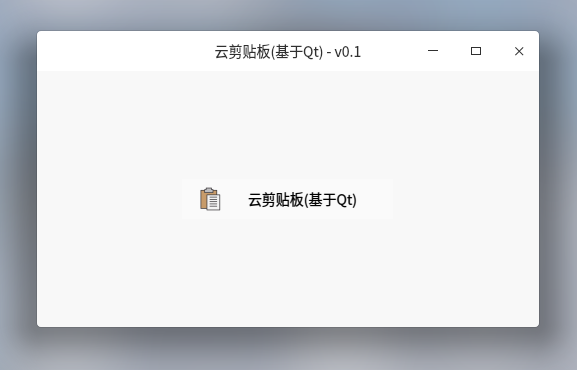

# 云剪贴板客户端(qt.qgo-clipboard-client)

> 云剪贴板的客户端

## 效果预览

- 托盘效果图\
      

- 客户端效果图(主窗口新图片预览)\
     


### 云端部署，客户端依赖

- [云剪贴板服务端(基于Golang)][clipboard-server]

[clipboard-server]: https://gitee.com/zinface/go.clipboard-server

### 应用逻辑

1. 监听剪贴板变化并发布到服务器
2. 轮询服务器最新变化(3秒一次)
3. 将服务器新内容同步到剪贴板

### 定义个人服务器服务地址

- 修改路径定义文件 `backend/config.h`
    ```c
    #ifndef __CONFIG__H__
    #define __CONFIG__H__

    // 将此部分改为你的部署服务器(请使用配套的服务端)
    #define REMOTE_HOST "http://127.0.0.1:9090"

    #endif  //!__CONFIG__H__
    ```